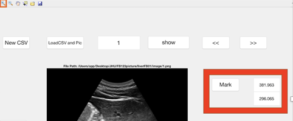
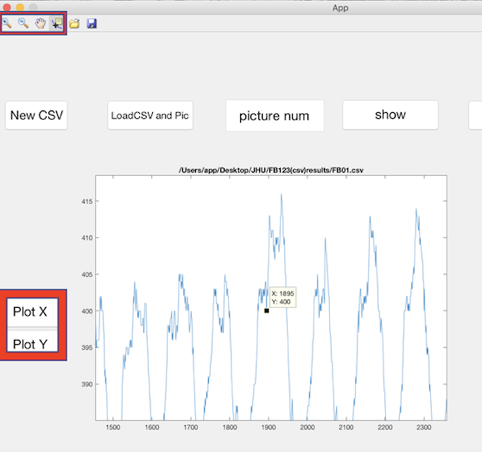
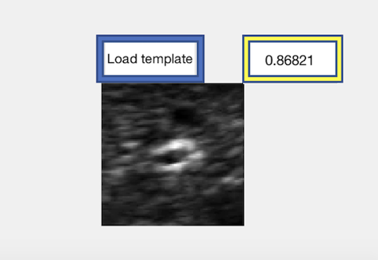

# Cancer-Pinpoint
My project (finished during summer 2017) is a part of a larger project at Johns Hopkins University to use ultrasound to track the movement of cancer and then guide radiation therapy to follow and target cancer.

## Introduction
Intensity-modulated radiation therapy (IMRT) is a targeted treatment currently widely used in curing cancer. It could target at the cancer area and thus bringing less harm to surrounding normal areas. However, with the interference of involuntary motion, including respiration, cardiac activity, we have to target at the whole areas that cancer may move around, which also harms the normal tissues during treatments. Our goal is to use ultrasound to track the movement of cancer and then guide the radiation therapy to follow and target at the cancer. 

My project is a part of this project. It could help users to manually annotate the coordinates of cancers and then examine the correctness of the data from ultrasound.

## Features
All the functions can be realized by GUI. 

##### 1.Annotate coordinates
User can first create a .csv file through the button "New CSV", and then load this new file and the pictures to be marked through the button "LoadCSV and Pic". After user clicks "mark", a cursor will appear and then the user can mark the position of the cancer. The coordinates will be shown and also be recorded in the loaded file.

##### 2.Plot the coordinates
User can load a .csv file that contains the coordinates of cancers. Clicking the button "Plot X" or "Plot Y", user can view the trend of cancer's movement.

##### 3.Examine the correctness of the data from ultrasound by comparing them with the manually annotated data.  
User can load a .csv file that contains the coordinates of cancers (from ultrasound). Clicking the button "Load Template", user can precisely mark the center of the cancer. This is used as the template for examing the overlap ratio between the template and the data from .csv file. Overlap ratio is from 0.0 to 1.0, and a higher value indicates a more correct data from .csv file.

